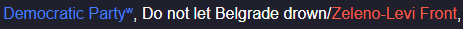
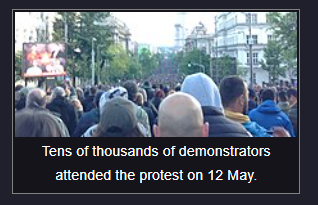
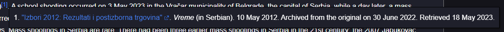
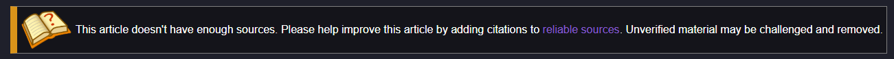
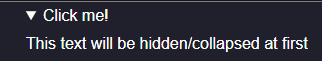
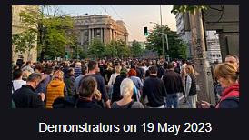
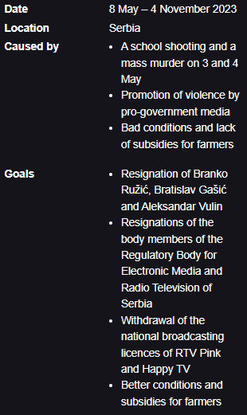
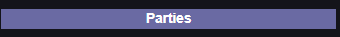
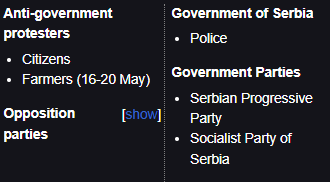
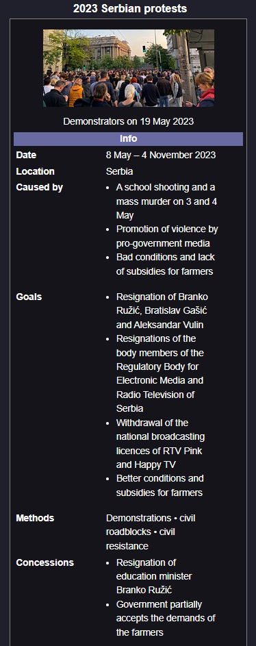

_In this documentation and any other text, "article" refers only to the text on a single page, while "page" refers to everything, including the article._

## Table of Contents

- [Getting started](#getting-started)
- [Editing guidelines](#editing-guidelines)
  - [1. Objectivity](#1.-objectivity)
  - [1a. What is a valid source?](#1a.-what-is-a-valid-source?)
  - [2. Adding images to pages](#2.-adding-images-to-pages)
  - [3. Vandalism and abuse](#3.-vandalism-and-abuse)
  - [4. Articles about non-public figures](#4.-articles-about-non-public-figures)
- [Site functionality](#site-functionality)
  - [Basics](#basics)
  - [User ranks and page protection](#user-ranks-and-page-protection)
  - [Special pages](#special-pages)
- [Syntax documentation](#syntax-documentation)
  - [Basics](#basics)
  - [Headings](#headings)
  - [Hyperlinks and images](#hyperlinks-and-images)
  - [Citing sources](#citing-sources)
  - [Annotations](#annotations)
  - [Redirect](#redirect)
  - [Dropdown](#dropdown)
  - [Infobox](#infobox)

## Getting started

It's easier than you think, just open the [sandbox](https://srb.graphite.in.rs/en/sandbox) and start writing about anything related to the wiki. Your city, local politicians, examples of corruption, or major scandals that everyone has heard of are all great topics for an article. You can also contribute to existing pages with new findings and information. If you’re going to create new pages, first check if there is a page that already covers that topic, even if it doesn't have the same title as yours. If the topics are identical (e.g., this year's student protests and student blockades), you can create a [redirect](#redirect).

## Editing guidelines

### 1. Objectivity

When writing articles for the wiki, please maintain objectivity. By spreading misinformation, we are no better than the people we write about. Any major claim must be supported by a valid source, otherwise, it can be deleted at any time by other users. It is also advisable to maintain the so-called journalistic writing style, where information is conveyed to the reader in a concise and direct manner.

### 1a. What is a valid source?

A valid source is one that supports the provided claim and is reliable.

**Good sources include:** A scientific paper published in a reputable academic journal, a newspaper article written and published in a trustworthy newspaper. Video or photo material that clearly depicts and supports the provided claim.

**Bad sources include:** A newspaper article without an author, published in a publication known for spreading misinformation. Information based on "...I heard somewhere/from someone...".

A source added to an article **must** include a title, the platform on which it was published (N1, RTS, Instagram @...), and the publication date, while other details are desirable but not mandatory. The source **must** be _up-to-date_.

### 2. Adding images to pages

Please ensure that you protect our project from legal issues by only adding images for which you have permission to use. This includes direct permission from the image's author as well as free-use/images in the public domain. Adding irrelevant images to pages is considered abuse. The use of AI-generated images is prohibited.

### 3. Vandalism and abuse

Due to the widespread network of bots in the Serbian internet space, a **ZERO TOLERANCE** policy for vandalism has been implemented. Clear vandalism will be immediately sanctioned by removal from the wiki (ban). The only people who can lift bans are users with system administrator privileges, and you can appeal a ban to them in the Discord server, though the removal of the ban is not guaranteed.

Abuse and vandalism in this sense include:

- Intentional modification of an article to include inappropriate, false, biased content, or content that disrupts the tone of the wiki.
- Creating pages unrelated to the topic of the wiki.
- Adding images without permission to use them, or images unrelated to the page. Adding AI-generated images.
- Any attempt of _server-side_ disruption.

Some pages may be protected, meaning only verified users can edit them. Users are verified by site administrators. More information about protection can be read below.

### 4. Articles about non-public figures

The popular idea when this site was first launched was to create a list of loosely government-related wrongdoers. We kindly ask that, if these individuals are not public figures or do not hold a public office, you avoid creating pages dedicated to them. We understand (and justify) the anger towards these individuals, but publishing someone's name, surname, and photo falls under the illegal disclosure of private information, i.e., _doxxing_. Some media outlets in Serbia regularly do this, but those media outlets somehow fly under the radar while violating this and many other laws, and our site does not have such privileges.

Of course, you can still mention these individuals on other pages if they are relevant to the topic.

## Site functionality

### Basics

The SerbiaWiki site is made up of pages. Each page, in addition to the article itself, has its own:

- **Metadata**, which describes the article in a summarized format. These appear in Google search and similar platforms.
- **Images**, which are used in the article. While it is possible to directly use an image URL in the article, by uploading the image to the page, you ensure it will not be deleted (unless you violate copyright or the image is irrelevant).
- **History**, which tracks changes on a page. Each _entry_ in the history has a date when it was published and the changes made. The changes type can be HTML (changes to the article) or META (changes to the metadata), and META changes cannot be directly reverted, although they are tracked.

### User ranks and page protection

Each page can, but does not have to, be protected (this is part of the page's metadata). Page protection has three levels:

- **Basic**: Where only verified users and those above them have editing rights.
- **Advanced**: Where only administrators and those above them have editing rights.
- **System**: Used to protect key pages, where only system administrators have editing rights.

Users are divided into five ranks:

- **User**: The default option, with no special privileges.
- **Verified user**: A rank for users who have demonstrated responsible editing of pages. The only difference between them and regular users is the ability to edit pages under basic protection and remove images from the wiki.
- **Administrator**: A rank granted by system administrators. They can remove users who violate editing rules and apply protection to pages.
- **Senior administrator**: A rank granted by system administrators. They can delete pages that violate editing rules, move pages, and elevate users to verified user status.
- **System administrator**: A rank that has full control over the wiki.

### Special pages

Special pages are those with the prefix `Special:`. They are always under system protection and serve a purpose essential for the functioning of the site.

Currently, the only special pages are:

- **Admin Log**, which tracks all significant changes on the site, such as the creation/removal of new pages, images, and actions taken on users.
- **Sandbox**, where you can write articles and see how they look without publishing them. **The Sandbox is stored in your browser's local memory, which you may accidentally erase while clearing your history/cookies. Be careful.**

## Syntax documentation

We recommend that you read this part of the documentation as needed, as it can be lengthy and difficult to understand if read all at once. The most important part of an article is the text itself, and for that, you only need a keyboard and a will to write.

### Basics

The language used to write articles on this wiki is custom (enhanced) HTML. This means that technically, you can write all articles in plain HTML, but we ask that you reserve the use of raw HTML for more complex applications that aren't already integrated into our wiki language.

For complete HTML beginners, this language consists of tags. Most tags need to be closed, and the effects of a tag apply to the text within it. Opening and closing a tag represent one element.

Some basic tags we have not made custom, and we do not plan to, because they cannot be further simplified:

- `<i></i>` makes the text within the tags _italic_.
- `<b></b>` makes the text within the tags **bold**.
- `<ul></ul>` together with `<li></li>` creates lists. You can read more about this here.

There is no need to use `<br>` or `<p>`, as the wiki automatically converts new lines in the editor into paragraphs.

### Headings

Headings are added to an article using the `<w-h1></w-h1>` tags, where the number (1 in this case) indicates the size of the heading. The largest headings are marked with 1, medium ones with 2, and the smallest with 3.

### Hyperlinks and images

Hyperlinks are added to an article using the `<w-a></w-a>` tag. You need to first enter the text that will replace the link, followed by the URL, separated by a vertical bar (|). If you want to link to another page on SRBWiki, simply enter an article title instead of the URL. Keep in mind that titles are case-sensitive.

External links, which lead outside SRBWiki, have a small icon next to them indicating this, while internal links leading to non-existent pages are colored in red. External links leading to `wikipedia.org` have a small "w" letter instead of the usual icon.

Here are some valid links:
`<w-a>Green–Left Front</w-a>`

`<w-a>Zeleno-Levi Front|Green–Left Front</w-a>`

`<w-a>Democratic Party|https://en.wikipedia.org/wiki/Democratic_Party_(Serbia)</w-a>`

This is how three hyperlinks look on the "2023 Protests Against Violence" page:



Images are added to an article in a similar way, using the `<w-img></w-img>` tag. You separate the text below the image (caption) and the URL of the image with a vertical bar.

`<w-img>Tens of thousands of demonstrators attended the protest on 12 May.|https://direktno.rs/upload/media/2025/0/27/17/37/142/1108632/resize/1108647/protest_studenata_blokada_autokomande_foto_direktno_3_529x940</w-img>`

If you have uploaded the image to the page, simply type the image's filename and extension. For example:

`<w-img>Tens of thousands of demonstrators attended the protest on 12 May.|protest2.jpg</w-img>`



### Citing sources

References are added to the article using the `<w-ref></w-ref>` tag. The text within the tag will be displayed as an inline citation in the article.

`<w-ref name="postizborna-trgovina"><w-a>"Izbori 2012: Rezultati i postizborna trgovina"|https://www.vreme.com/projekat/izbori-2012-rezultati-i-postizborna-trgovina/</w-a>. <i>Vreme</i> (in Serbian). 10 May 2012. Archived from the original on 30 June 2022. Retrieved 18 May 2023.</w-ref>`



If you add the `name` attribute to a reference, which is not require, you can reuse it by inserting the reference with that name again, but without any text within the tags. Using the example above:

`<w-ref name="postizborna-trgovina"></w-ref>`

This will be displayed the same way as the first example.

At the end of the article, you need to place the `<w-reflist></w-reflist>` tag to ensure that all references and sources appear at the bottom of the page.

### Annotations

Annotations are elements used at the beginning of the text to highlight some information for the reader. There are three types: `default`, `warn`, and `danger`, which are set using the `type` attribute.

`<w-annotation image="https://upload.wikimedia.org/wikipedia/en/thumb/9/99/Question_book-new.svg/512px-Question_book-new.svg.png?20210726203442" type="warn">This article doesn't have enough sources. Please help improve this article by adding citations to <a href="https://github.com/Graphite2213/SNSWiki-Pages/blob/master/en/README.md#references-">reliable sources</a>. Unverified material may be challenged and removed.</w-annotation>`



### Redirect

If a page has a title that is a common variation of another page, you can create a redirect to that other page like this:

`<w-redirect>Other article title</w-redirect>`.

### Dropdown

A dropdown is an element that appears as a hidden part of the text, revealed by clicking on the arrow. It is used by wrapping the text you want to hide within the `<w-drop></w-drop`> tags. You also need to set the title attribute, which defines the text next to the arrow.

`<w-drop title="Click me!">This text will be hidden/collapsed at first</w-drop>`



### Infobox

The infobox is an element in the article that appears as a small box containing summarized information about the topic you are writing about. Below, you can see how they look on Wikipedia.

This is the only complex element on the wiki, meaning it consists of multiple other elements. Each infobox starts with the `<w-infobox></w-infobox>` tag, within which you arrange the other infobox elements.

Infobox elements are:

The `<wi-img></wi-img>` tag represents an image and is used in the same way as the `<w-img></w-img>` tag.



The `<wi-row></wi-row>` tag represents a new row. The left and right values are separated by the character `|`. Below is an image with several examples:



The `<wi-section></wi-section>` tag represents the title of a separate section within the infobox rows.



You can also create a VS (versus) list in the infobox, where you display two opposing sides. You do this as follows:

```html
<wi-vs>
  <wvs-side>
    <wvs-p list="Anti-government protesters">
      <ul>
        <li>Citizens</li>
        <li>Farmers (16-20 May)</li>
      </ul>
    </wvs-p>
    <wvs-p list="Opposition parties" collapsed="true">
      <ul>
        <li>Do not let Belgrade drown/Green–Left Front</li>
        <li>Democratic Party</li>
        <li>People's Party</li>
        <li>Party of Freedom and Justice</li>
        <li>Movement of Free Citizens</li>
        <li>Together</li>
      </ul>
    </wvs-p>
  </wvs-side>

  <wvs-side>
    <wvs-p list="Government of Serbia">
      <ul>
        <li>Police</li>
      </ul>
    </wvs-p>
    <wvs-p list="Government Parties">
      <ul>
        <li>Serbian Progressive Party</li>
        <li>Socialist Party of Serbia</li>
      </ul>
    </wvs-p>
  </wvs-side>
</wi-vs>
```

The `<wi-vs></wi-vs>` tag represents the vs (versus) element itself. The `<wvs-side></wvs-side>` tag represents one of the two sides, while the `<wvs-p></wvs-p>` tag represents a party on that side. If the party is a list, you need to set the `list` attribute, which represents the title above that list. If you set the `collapsed` attribute to `true`, the list will be collapsible.



This is what a full infobox looks like on the wiki:



The complete code for that example would be:

```html
<w-infobox type="person" title="2023 Serbian protests">
  <wi-img>Demonstrators on 19 May 2023|protest.jpg</wi-img>

  <wi-header>Info</wi-header>
  <wi-row>Date|8 May – 4 November 2023</wi-row>
  <wi-row>Location|Serbia</wi-row>
  <wi-row
    >Caused by|
    <ul>
      <li>A school shooting and a mass murder on 3 and 4 May</li>
      <li>Promotion of violence by pro-government media</li>
      <li>Bad conditions and lack of subsidies for farmers</li>
    </ul></wi-row
  >
  <wi-row
    >Goals|
    <ul>
      <li>Resignation of Branko Ružić, Bratislav Gašić and Aleksandar Vulin</li>
      <li>
        Resignations of the body members of the Regulatory Body for Electronic
        Media and Radio Television of Serbia
      </li>
      <li>
        Withdrawal of the national broadcasting licences of RTV Pink and Happy
        TV
      </li>
      <li>Better conditions and subsidies for farmers</li>
    </ul></wi-row
  >
  <wi-row>Methods|Demonstrations • civil roadblocks • civil resistance</wi-row>
  <wi-row
    >Concessions|
    <ul>
      <li>Resignation of education minister Branko Ružić</li>
      <li>Government partially accepts the demands of the farmers</li>
    </ul></wi-row
  >
  <wi-header>Parties</wi-header>
  <wi-vs>
    <wvs-side>
      <wvs-p list="Anti-government protesters">
        <ul>
          <li>Citizens</li>
          <li>Farmers (16-20 May)</li>
        </ul>
      </wvs-p>
      <wvs-p list="Opposition parties" collapsed="true">
        <ul>
          <li>Do not let Belgrade drown/Green–Left Front</li>
          <li>Democratic Party</li>
          <li>People's Party</li>
          <li>Party of Freedom and Justice</li>
          <li>Movement of Free Citizens</li>
          <li>Together</li>
        </ul>
      </wvs-p>
    </wvs-side>

    <wvs-side>
      <wvs-p list="Government of Serbia">
        <ul>
          <li>Police</li>
        </ul>
      </wvs-p>
      <wvs-p list="Government Parties">
        <ul>
          <li>Serbian Progressive Party</li>
          <li>Socialist Party of Serbia</li>
        </ul>
      </wvs-p>
    </wvs-side>
  </wi-vs>
</w-infobox>
```
